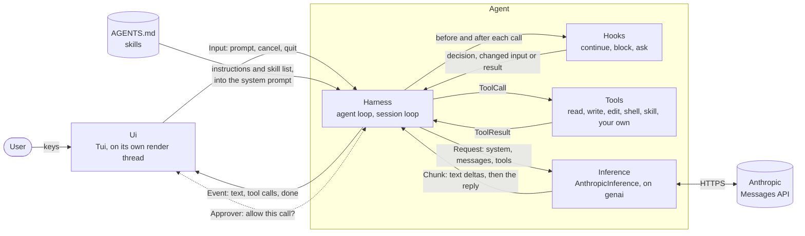

# haarniska

No bullshit library-first, extensible coding agent harness. Under development.

See `examples` for demo.

Documentation in `docs` is mostly for agents but should be in readable state.

## Features

- **You pick the name** — use the library to build a binary of your own.
- **Fast startup** — prompt on screen in a few milliseconds; the rest starts
  up behind it.
- **Highly customizable** — flexible API designed for custom usage.
- **Built-in tools** — read, write, edit, shell.
- **Custom tools** — every tool implements a trait, the world is your oyster.
- **Hooks** — block or change tool calls, or ask the user first.
- **Consent** — approve chosen tool calls before they run.
- **Project instructions** — layered `AGENTS.md`, with `CLAUDE.md` fallback.
- **Skills** — Agent Skills format, loaded on demand.
- **Anthropic API inference provider** — use Anthropic models or build your own provider.
- **Core Agent loop** — streams the reply, runs tool calls, repeats until done.
- **Terminal UI** — minimalistic streaming UI.
- **Headless mode** — run your agent without UI if you want.

## Future feature ideas

- Telemetry
- Render responses as markdown
- Auto-mode
- MCP support
- Plugin support
- More providers

## Architecture

An agent is a harness plus inference. The harness runs the loops, the tools,
and the hooks around them; a UI is handed over only for an interactive
session.

Headless use skips the UI: `agent.prompt(...)` returns the same events as a
stream. Without an approver, a call a hook wants consent for is blocked.

| Module                  | Holds                                    |
| ----------------------- | ---------------------------------------- |
| `harness`               | The loops and their events               |
| `harness::tool`         | The `Tool` trait                         |
| `harness::hook`         | The `Hook` trait, consent                |
| `harness::instructions` | `AGENTS.md` layers                       |
| `harness::skills`       | Skill discovery and loading              |
| `inference`             | The `Inference` trait and its data model |
| `inference::anthropic`  | The Anthropic adapter                    |
| `tools`                 | The built-in tools                       |
| `ui`                    | The `Ui` trait                           |
| `tui`                   | The terminal UI                          |

## License

MIT

## Contributing

Not expecting any external contributions right now. Please open issue before anything and let's discuss.

## Backlog

- Release automation & CI
