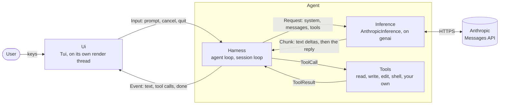

# haarniska

Library-first, extensible coding agent harness. Under development.

See `examples` for demo.

Documentation in `docs` is mostly for agents but should be in readable state.

## Architecture

An agent is a harness plus inference. The harness runs the loops and the
tools; a UI is handed over only for an interactive session.

Headless use skips the UI: `agent.prompt(...)` returns the same events as a
stream.

## License

MIT
